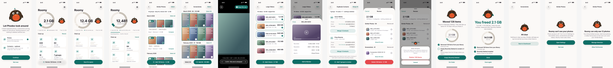

# Roomy

A storage cleaner for iPhone that finds **similar photos, screenshots, large videos and duplicate contacts**,
and removes them only after you review them. Everything runs on the phone; nothing is uploaded, and there is
no account.

Built for the AppFactory App Builder selection task. iOS 17+, SwiftUI, Swift 6, no third-party packages.
The mascot is Roomy, a small robin that perches on the storage ring and reacts to what the app is doing.



## Build and run

Requirements: Xcode 26.3+ and [XcodeGen](https://github.com/yonaskolb/XcodeGen) (`brew install xcodegen`).

```bash
xcodegen generate          # creates Roomy.xcodeproj from project.yml
open Roomy.xcodeproj
```

- **Simulator:** pick any iPhone simulator and Run. To get test data, drag photos into the simulator or use
  `xcrun simctl addmedia booted <files>` (images, videos and `.vcf` contacts all work).
- **iPhone with a free Apple ID:** Roomy target → Signing & Capabilities → Team = your Personal Team, and
  change the bundle id if `com.gauravsingh.roomy` is taken. Free provisioning expires after 7 days; run again
  from Xcode to renew. See [docs/DEVICE.md](docs/DEVICE.md).
- **Checks:** `scripts/check.sh` runs the architecture rules, `swift-format` lint, a zero-warning build and
  the unit tests. `scripts/check.sh --fast` skips the build.

## What it does

| Area | How |
|---|---|
| Storage dashboard | Free / used from `volumeAvailableCapacityForImportantUsage` (the closest API to Settings); a usage bar with Roomy the robin perched above it; reclaimable space found by the scan |
| Similar photos | 64-bit difference hash per photo; every burst frame grouped by its burst id; duplicates across the whole library (Hamming ≤ 4, every such pair found with 5 LSH bands, crowded bands split again), near-identical shots only within one moment (first to last shot ≤ 60 s, same aspect, Hamming ≤ 10); flat frames (dark, white, blank) never linked on their hash; union-find into groups labelled by what holds for every member; a keeper picked by favourite, the burst pick, resolution, sharpness (Laplacian variance), then size — and you can make any photo the keeper; other favourites and picked burst frames are never selected in bulk |
| Screenshots | The Photos screenshot subtype, in a month-grouped 9:16 grid |
| Large videos | Sorted by real on-disk size, with an inline player |
| Duplicate contacts | Cards are linked only by a shared phone number (international form, read in the phone's region; an extension is part of the number, so two extensions of one line are two people) or email (case); a shared name alone never groups cards; a value on more than 3 cards links them only when their names agree, so exact copies are found and switchboards are not; the label shows the weakest link; merge preview shows every value and where it comes from |
| Review and delete | One basket across all categories → Review → one red button → confirmation → iOS's own Photos prompt |
| Permissions | Photos and Contacts each handle not-asked, limited, denied and restricted, with a way forward in every state |

## Decisions and tradeoffs

- **Precision over recall.** A wrong group means someone deletes a photo they wanted. Near-duplicates are
  only grouped inside one moment and one orientation; every group shows why it exists ("Exact duplicate",
  "Taken 2s apart"). A 20,000-photo test with planted duplicates must produce exactly the planted groups.
- **dHash, not Vision feature prints.** Microseconds per image, deterministic, cacheable by asset id +
  modification date so rescans only hash new photos. Vision is semantic ("same dog, different photo"), slower
  and needs calibration. The thumbnail fetch is the real cost either way.
- **One basket, one delete path.** Category screens only select. The only code that can delete is
  `Services/Deletion/`, reachable only from Review's confirmation. `scripts/check.sh` fails the build if a
  deletion API appears anywhere else.
- **Removed is not freed.** Deleted photos sit in Recently Deleted for 30 days and no API can empty it. Roomy
  says "Moved 10 items — not freed yet", shows the exact steps in Photos, measures free space again when you
  come back, and only when free space has risen by about what was moved says "2.1 GB more free space" with the
  measured number. A much bigger rise (an app deleted too) proves nothing, so the reminder stays.
- **Contacts are backed up before they change.** Merging has no system prompt and no undo, so every affected
  card is written to a vCard first, photos included (Settings → Contact backups; share the file to Contacts to
  restore). A run that merges nothing keeps no backup. Merges keep every phone, email, address, URL, profile,
  relation and date, and fill empty name, nickname, phonetic, company and birthday fields; the preview and the
  merge combine values with one shared function. Notes can't be read by apps, so the contacts screen and the
  confirmation say notes on removed cards aren't carried over. A card edited after the scan stops its group
  from merging, and a group Contacts refuses to save (a read-only account) is not offered again.
- **Contacts need full access.** With iOS 18 limited access Roomy would see a handful of cards and miss most
  duplicates, so it explains that instead of showing a misleadingly short list.
- **File sizes via `PHAssetResource` KVC.** There is no public size API; every cleaner reads `fileSize` this
  way. It is optional everywhere: unknown sizes read "size unavailable" and never count as a guess.
- **Designed in Figma first** ([file](https://www.figma.com/design/vkLwPMTONVGAW83m8B1oK8)): iOS 26 Liquid
  Glass only in the navigation layer (bars, the review capsule, primary buttons), opaque content, one
  `RoomyGlass` modifier with the iOS 17/18 fallback.

## Architecture

```
App ──► Features ──► Stores ──► Services ──► Core
            └──────► Design ──────────────────┘
```

- **Core** — value types and pure algorithms (hashing, grouping, contact matching, merge preview). Unit-tested.
- **Services** — the only code touching Photos, Contacts, AVFoundation and files. Returns Sendable values.
- **Stores** — `@Observable` state: `ScanStore`, `DuplicateContactsStore`, `Basket`, `CleanupStore`, wired in `AppState`.
- **Features** — one folder per screen, with small pure presentation structs (`DashboardSummary`,
  `ReviewSummary`, `ResultSummary`) that carry every label and mood, and are tested.
- **Design** — tokens mirrored from Figma, components, and Roomy the mascot drawn in SwiftUI (9 moods).

Concurrency: the scan runs off the main actor and streams ordered events; a newer scan cancels an older one,
which never writes state again. Every callback that could fire twice or never goes through `ResumeOnce`.
The full rulebook is [docs/ENGINEERING.md](docs/ENGINEERING.md).

## Performance

- Grouping 20,600 photos (hashes cached): **0.09 s** in the unit test on the simulator.
- End-to-end first scan in the simulator: see [docs/PERFORMANCE.md](docs/PERFORMANCE.md).
- Rescans reuse the hash cache, so only new or edited photos are decoded.

## Scope

Built: everything in the brief (dashboard, similar photos with best pick, screenshots, large videos, duplicate
contacts with merge, review-before-delete, denied and limited permissions).

Skipped on purpose: video compression (slow, hard to verify, needs a save-then-delete flow), widget (needs App
Groups, which a free Apple ID can't use), Face ID vault (iOS already has a locked Hidden album), TestFlight
(paid account), and anything from the out-of-scope list.

## How it was built

Claude Code (Opus) wrote the code with me directing and reviewing: planning, the Figma design through the
Figma MCP, Xcode builds and the iOS Simulator through their tools, and Axiom's iOS skills and auditors
(concurrency, accessibility, UX flow, Liquid Glass, privacy) as a second review. Each audit finding was fixed
in code or recorded above.
