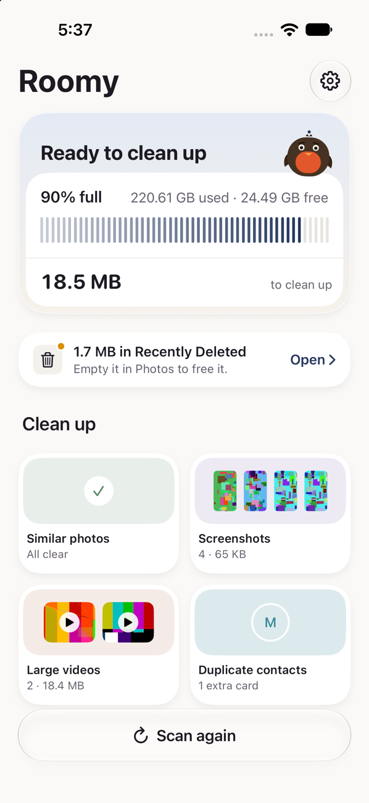
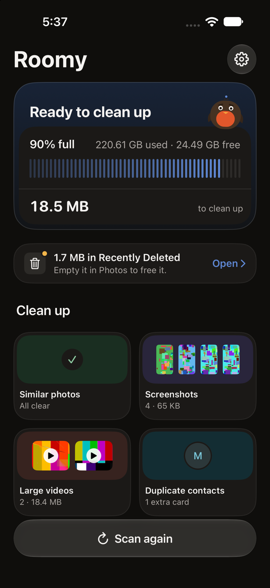

# Roomy

A storage cleaner for iPhone that finds **similar photos, screenshots, large videos and duplicate contacts**,
and removes them only after you review them. Everything runs on the phone; nothing is uploaded, and there is
no account.

Built for the AppFactory App Builder selection task. iOS 17+, SwiftUI, Swift 6, no third-party packages.
The mascot is Roomy, a small robin that sits on the storage card and reacts to what the app is doing.

<p align="center">
  
  &nbsp;&nbsp;
  
</p>

Every screen, as built. Screenshots from the iOS 27 simulator with synthetic test photos and contacts; every screen was designed in Figma first ([file](https://www.figma.com/design/vkLwPMTONVGAW83m8B1oK8)):


## Build and run

**You need:** a Mac with **Xcode 26.3 or later** (Xcode 27 to install on an iPhone running iOS 27). No packages,
no accounts, no network: everything builds from this repository.

### Quick start (simulator)

1. Clone or unzip the repository, then open **`Roomy.xcodeproj`** in Xcode. The project is committed, so nothing
   needs generating.
2. Choose the **Roomy** scheme and any iPhone simulator (iOS 17 or later), then press **Run** (⌘R).
3. The simulator's library is almost empty. Add test media by dragging photos, videos or a `.vcf` contacts file
   onto the simulator window, or from Terminal:

   ```bash
   xcrun simctl addmedia booted ~/Pictures/some-photos/*.jpg ~/Movies/clip.mov ~/Desktop/contacts.vcf
   ```

   To see similar-photo groups, add the same photo twice, or a few shots taken seconds apart. Add a contact twice
   with the same phone number to see duplicate contacts. Then tap **Scan again** in Roomy.

### On an iPhone

1. Connect the iPhone, tap **Trust**, and turn on **Settings → Privacy & Security → Developer Mode** (it restarts).
2. In Xcode → Settings → Accounts, sign in with an Apple ID. A free Personal Team is enough.
3. Select the **Roomy** target → **Signing & Capabilities** → Team: your team. If Xcode says the bundle id is taken,
   change it to something unique, such as `com.yourname.roomy`.
4. Choose the iPhone as the run destination and press **Run**. On first launch, trust the developer on the phone:
   Settings → General → VPN & Device Management → your Apple ID → Trust.

Free provisioning lasts 7 days. [docs/DEVICE.md](docs/DEVICE.md) has the details, including a signing setup that
survives regenerating the project.

### Tests and checks

- **Tests:** ⌘U in Xcode runs 318 unit tests (no photo library needed; they use fakes).
- **Full gate:** `scripts/check.sh` runs the architecture rules, `swift-format` lint, a zero-warning simulator build,
  the tests, and an unsigned iPhone build that fails on any warning. `scripts/check.sh --fast` skips the builds.
- **Editing the project structure:** files are listed in `project.yml`; after adding or moving files run
  `xcodegen generate` ([XcodeGen](https://github.com/yonaskolb/XcodeGen), `brew install xcodegen`).

### Privacy

Roomy runs entirely on the device: it makes no network requests, collects nothing, and has no account. Photos and
contacts never leave the phone, and nothing is deleted without two confirmations (Roomy's own, then iOS's).

## What it does

| Area | How |
|---|---|
| Onboarding | Three pages: an animated welcome (a storage bar fills, turns red, then sweeps down as Roomy lands), how it works, and permissions in every state; Skip never passes the permissions page. No login or account: the brief puts them out of scope and nothing leaves the phone. Onboarding shows once; every later launch opens with a two-second version of the welcome story (tap to skip, none with Reduce Motion) while the scan starts underneath |
| Storage dashboard | Free / used from `volumeAvailableCapacityForImportantUsage` (the closest API to Settings), shown as "92% full" and a tick bar; what the scan can clean up; one bottom capsule that is always the next action: Scan for space, Cancel scan (with progress), Resume scan, Scan again, or Review |
| Similar photos | 64-bit difference hash per photo; every burst frame grouped by its burst id; duplicates across the whole library (Hamming ≤ 4, every such pair found with 5 LSH bands, crowded bands split again), near-identical shots only within one moment (first to last shot ≤ 60 s, same aspect, Hamming ≤ 10); flat frames (dark, white, blank) never linked on their hash; union-find into groups labelled by what holds for every member; a keeper picked by favourite, the burst pick, resolution, sharpness (Laplacian variance), then size — and you can make any photo the keeper; other favourites and picked burst frames are never selected in bulk |
| Screenshots | The Photos screenshot subtype, in a month-grouped 9:16 grid |
| Large videos | Sorted by real on-disk size, with an inline player |
| Duplicate contacts | Cards are linked only by a shared phone number (international form, read in the phone's region; an extension is part of the number, so two extensions of one line are two people) or email (case); a shared name alone never groups cards; a value on more than 3 cards links them only when their names agree, so exact copies are found and switchboards are not; the label shows the weakest link; merge preview shows every value and where it comes from |
| Review and delete | One basket across all categories → Review → one red glass Delete button → confirmation → iOS's own Photos prompt. The Delete button never sits where the Review capsule was tapped, so a double tap can't reach it |
| Result | The amount moved on the same tick bar as the dashboard, where the last used tick rises into a marker: an amber outline with "in Recently Deleted" until free space is measured again, then solid green with "now free" |
| Settings | Photos and Contacts access, rescan, contact backups, how deletion works, and Appearance (System, Light, Dark) |
| Permissions | Photos and Contacts each handle not-asked, limited, denied and restricted, with a way forward in every state |

## Decisions and tradeoffs

- **Precision over recall.** A wrong group means someone deletes a photo they wanted. Near-duplicates are
  only grouped inside one moment and one orientation; every group shows why it exists ("Exact duplicate",
  "Taken 2s apart"). A 20,000-photo test with planted duplicates must produce exactly the planted groups.
- **dHash, not Vision feature prints.** Microseconds per image, deterministic, cacheable by asset id +
  modification date so rescans only hash new photos. Vision is semantic ("same dog, different photo"), slower
  and needs calibration. The thumbnail fetch is the real cost either way.
- **One basket, one delete path.** Category screens only select. The only code that can delete is
  `Services/Deletion/`, reachable only from Review's confirmation. `scripts/check.sh` fails the build if a
  deletion API appears anywhere else.
- **Removed is not freed.** Deleted photos sit in Recently Deleted for 30 days and no API can empty it. Roomy
  says "Moved 10 items — not freed yet", shows the exact steps in Photos, measures free space again when you
  come back, and only when free space has risen by about what was moved says "2.1 GB more free space" with the
  measured number. A much bigger rise (an app deleted too) proves nothing, so the reminder stays.
- **Contacts are backed up before they change.** Merging has no system prompt and no undo, so every affected
  card is written to a vCard first, photos included (Settings → Contact backups; share the file to Contacts to
  restore). A run that merges nothing keeps no backup. Merges keep every phone, email, address, URL, profile,
  relation and date, and fill empty name, nickname, phonetic, company and birthday fields; the preview and the
  merge combine values with one shared function. Notes can't be read by apps, so the contacts screen and the
  confirmation say notes on removed cards aren't carried over. A card edited after the scan stops its group
  from merging, and a group Contacts refuses to save (a read-only account) is not offered again.
- **Scan at launch; stay quiet after.** The full scan (index, then comparing photos, with its progress in the bottom
  capsule) runs when Roomy launches and when you tap Scan again. Changes made outside Roomy — an iCloud sync, a trip
  to the Photos app, a new screenshot — only re-read the index, silently, at most every 30 s: whatever is gone leaves
  every list and new screenshots and videos appear, while new photos join similar groups at the next full scan.
  Roomy's own deletions and merges update every screen from the cleanup's report, with no rescan.
- **Merge, not delete, for duplicate contacts.** The brief allows "merge or delete"; Roomy merges.
  - *Delete* would remove the extra cards outright. If one had a second number, a work email or an address the
    other lacked, that detail is gone — and iOS shows no prompt and has no Recently Deleted for contacts.
  - *Merge* keeps one card and copies every phone, email, address, URL, profile, relation and date from the
    others into it (and fills its empty name, company and birthday fields), then removes the extra cards. The
    result is the same single card a delete would leave, with nothing lost.
  - Either way the extra cards are removed, so both clean the address book equally; merge is the safer version.
    Every card is written to a vCard backup first (Settings → Contact backups), and the merge goes through the
    same Review and confirmation as photos. A plain "delete extra cards" option could be added the same way, but
    it would only ever lose data compared with merge, so it was left out on purpose.
- **Contacts need full access.** With iOS 18 limited access Roomy would see a handful of cards and miss most
  duplicates, so it explains that instead of showing a misleadingly short list.
- **Only this iPhone, unless you ask.** With iCloud Photos and "Optimize iPhone Storage", many originals live
  only in iCloud: deleting one frees almost nothing here, yet removes it from iCloud and every device. So by
  default Roomy shows, counts and deletes only items stored on this iPhone; Settings → Library → "Include
  iCloud-only items" adds the rest, with their iCloud size named apart ("+ 3 GB in iCloud"). One rule
  (`LibraryScope`) filters every screen, total and Select All, and Review holds anything outside the scope, so
  a stale selection can't delete it. A similar group whose keeper is only in iCloud is hidden rather than shown
  with a stand-in keeper. The confirmation says that with iCloud Photos on, deleting also removes items from
  iCloud and your other devices.
- **File sizes via `PHAssetResource` KVC.** There is no public size API; every cleaner reads `fileSize` this
  way. It is optional everywhere: unknown sizes read "size unavailable" and never count as a guess.
- **Designed in Figma first** ([file](https://www.figma.com/design/vkLwPMTONVGAW83m8B1oK8)): every screen,
  loading state and animation was designed and approved there before it was built. iOS 26 Liquid Glass only in
  the navigation layer (bars, capsules, primary buttons), opaque content, one `RoomyGlass` modifier with the
  iOS 17/18 fallback. On iOS 27 the system re-tunes glass on its own; nothing relies on its transparency.
- **The moved amount is a marker, not an arc.** A cleanup usually moves under 1% of the phone, which a ring or
  bar can't draw honestly, so the result raises the last used tick at the real used/free boundary and states the
  amount in words underneath. Pending and freed differ in shape (outline, then filled with a check) and words,
  not colour alone.
- **Calm motion, always optional.** Skeletons shaped like the real layout (shown only if loading takes over
  0.3 s), a zoom from each category tile into its screen (iOS 18+), a staggered dashboard, the welcome
  story and its short launch version. Every animation has a Reduce Motion fallback, and timings live in the
  `Motion` token files.
- **Light, dark and tinted.** Every colour is a light/dark pair, the app icon has dark and tinted versions,
  and Settings can override the system appearance.

## Architecture

```
App ──► Features ──► Stores ──► Services ──► Core
            └──────► Design ──────────────────┘
```

- **Core** — value types and pure algorithms (hashing, grouping, contact matching, merge preview). Unit-tested.
- **Services** — the only code touching Photos, Contacts, AVFoundation and files. Returns Sendable values.
- **Stores** — `@Observable` state: `ScanStore`, `DuplicateContactsStore`, `Basket`, `CleanupStore`, wired in `AppState`.
- **Features** — one folder per screen, with small pure presentation structs (`DashboardSummary`,
  `ReviewSummary`, `ResultSummary`) that carry every label and mood, and are tested.
- **Design** — tokens mirrored from Figma, components, and Roomy the mascot drawn in SwiftUI (9 moods).

Concurrency: the scan runs off the main actor and streams ordered events; a newer scan cancels an older one,
which never writes state again. Every callback that could fire twice or never goes through `ResumeOnce`.
The full rulebook is [docs/ENGINEERING.md](docs/ENGINEERING.md).

## Performance

- Grouping 20,600 photos (hashes cached): **0.09 s** in the unit test on the simulator.
- End-to-end first scan in the simulator: see [docs/PERFORMANCE.md](docs/PERFORMANCE.md).
- Rescans reuse the hash cache, so only new or edited photos are decoded.

## Scope

Built: everything in the brief (dashboard, similar photos with best pick, screenshots, large videos, duplicate
contacts with merge, review-before-delete, denied and limited permissions), plus the bonus "space freed" summary.
Duplicate contacts are merged rather than deleted; see "Merge, not delete" above for why.

Skipped on purpose: video compression (slow, hard to verify, needs a save-then-delete flow), widget (needs App
Groups, which a free Apple ID can't use), Face ID vault (iOS already has a locked Hidden album), TestFlight
(paid account), and anything from the out-of-scope list.

## How it was built

Claude Code (Opus) wrote the code with me directing and reviewing: planning, the Figma design through the
Figma MCP, Xcode builds and the iOS Simulator through their tools, and Axiom's iOS skills and auditors
(concurrency, accessibility, UX flow, Liquid Glass, privacy) as a second review. Each audit finding was fixed
in code or recorded above.
